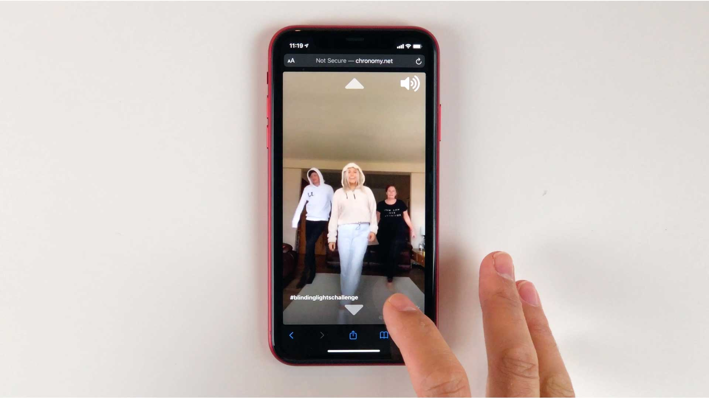

# chronomy-web

## Overview

Chronomy lets users curate [TikTok](https://www.tiktok.com/) playlists.

There is a lot of original, unique content on the platform but not all of it is suitable for a young audience.

Chronomy lets curators create playlists of suitable content and then share them with specific people.

Playlists are shared with deliberately long UUID based URLs to ensure they are effectively private and can't be discovered unintentionally.

This is the React frontend for app, the backend is here:
[github.com/will-head/chronomy-api](https://github.com/will-head/chronomy-api)



## Setup

```bash
$ npm install
$ npm start
```

## Testing

To run Jest and Enzyme run script:  

```bash
$ npm run test
```

## Deploy

The front end is deployed to a custom domain on [Surge](http://surge.sh/) at: [chronomy.net](http://chronomy.net/)

To deploy, run script (you need to be authorised to deploy on Surge):

```bash
$ npm run deploy
```

As a custom domain has been used, [staging.chronomy.net](http://staging.chronomy.net/) is also available. To deploy to staging run script:

```bash
$ npm run staging
```

## Approach

There are two distinct roles to the app:

1) Curator - create, update and share playlists  
2) Viewers - browse a single playlist on an unlisted URL

## Code Structure

The App component handles login and routing.

### Curators  

Sign up is handled by the SignUp component, and then a Curator can login.

The EditPlaylist component handles creating, updating and deleting playlists.

Playlists are submitted in full, and changes to playlists involve submitting the entire new playlist, rather than just the changes. This ensures a playlist is either changed entirely or not at all.

The button to copy a sharable URL will create a URL based on where the app is deployed, whether local, staging or production.

### Viewers

Viewers are presented with a mobile first interface, optimised for mobile phones. Video with autoplay in the Player, without audio.

Clicking the icon top right will mute/unmute the audio. Pressing in the middle of the display will Play/Pause the video.

The viewers can press on the up icon at the top of the Player to navigate to the previous TikTok in the playlist, or on the down icon at the bottom of the Player to navigate to the next.

There are also hidden controls on the left and right hand edges to navigate through the playlist for users more accustomed to Instagram stories.

## Improvements

* Include TikTok username above description
* Create optimised desktop browser view
